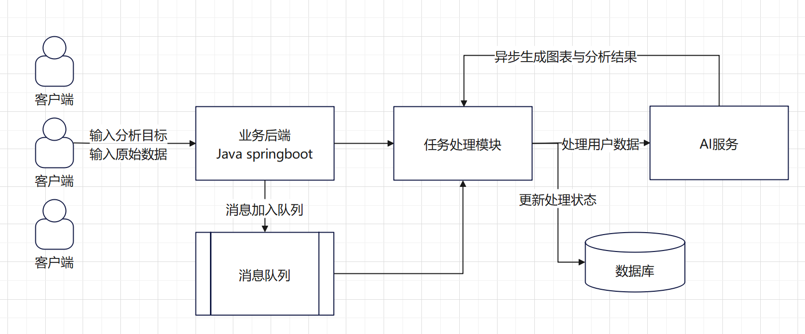

# 智能BI开发文档 

## 需求分析
1、	智能分析：用户输入目标和原始数据，可以自动生成图表和分析结论

2、	图表的管理：增删改查

3、	图表生成的异步化

4、	对接AI的能力

## 架构分析

### 基础方案：
客户输入分析目标和原始数据，向业务后端发送请求。业务后端利用AI服务处理客户端数据，保存到数据库，并生成图表和分析结果。处理后的数据由业务后端发送给AI服务，AI服务生成结果并返回给后端，最终将结果返回客户端展示。

### 问题：

AI服务（ChatGPT）回复需要时间且分钟内需求个数有限制，用户发送消息速率与AI服务接受速率存在同步场景。

### 改进方案：
增加消息队列，实现异步化

客户输入分析目标和原始数据，向业务后端发送请求。业务后端将请求事件放入消息队列，并为客户端生成排队号，消息队列根据AI服务负载情况，定期检查进度。如AI服务能处理更多请求，就向任务模块发送消息。

## 主流框架

- Spring Boot 2.7.x
- Spring MVC
- MyBatis + MyBatis Plus 数据访问（开启分页）
- Spring Boot 调试工具和项目处理器
- Spring 事务注解

## 数据存储

- MySQL 数据库
- Redis 内存数据库

## 工具类

- Easy Excel 表格处理
